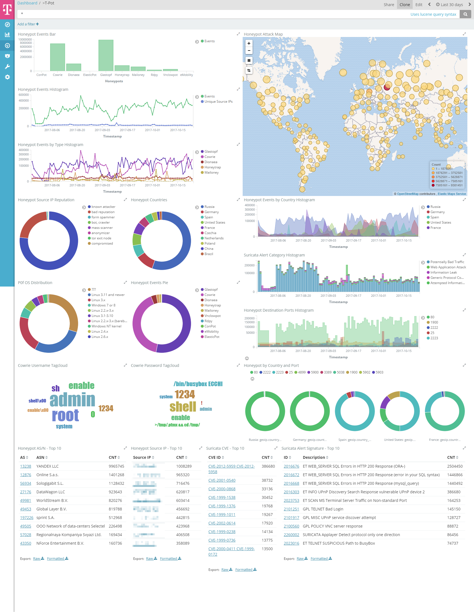

# Elasticsearch
 

# Logstash
 

# Kibana
 

# elk stack

[elk](http://www.elasticsearch.org/overview/) is a stack combining elasticsearch, logstash and the kibana dashboard. It is used to structure and visualize data in realtime.

This dockerized version is part of the **[T-Pot community honeypot](http://dtag-dev-sec.github.io/)** of Deutsche Telekom AG.

The `Dockerfiles` contain the blueprint for the dockerized elk stack and will be used to setup the docker images.  

# T-Pot Dashboard

