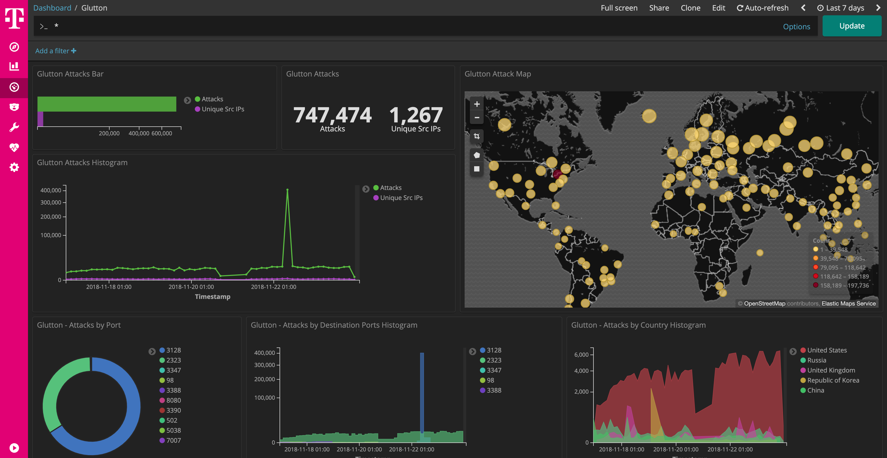

 

# glutton

[glutton](https://github.com/mushorg/glutton) is the all eating honeypot.

This dockerized version is part of the **[T-Pot community honeypot](http://dtag-dev-sec.github.io/)** of Deutsche Telekom AG.

The `Dockerfile` contains the blueprint for the dockerized glutton and will be used to setup the docker image.

The `docker-compose.yml` contains the necessary settings to test glutton using `docker-compose`. This will ensure to start the docker container with the appropriate permissions and port mappings.  

# glutton Dashboard

